# Diagramas de Arquitectura NOM-035

Este documento contiene diagramas visuales de la arquitectura del sistema.

## Diagrama de Arquitectura General

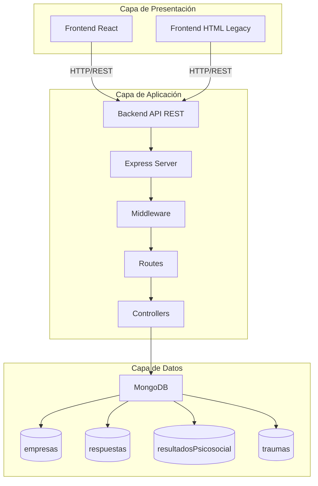

## Flujo de Datos - Registro de Empresa

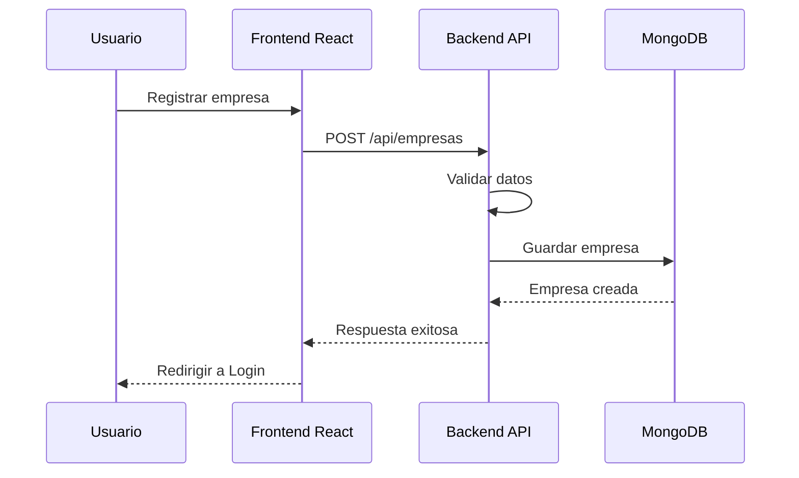

## Flujo de Datos - Evaluación Psicosocial

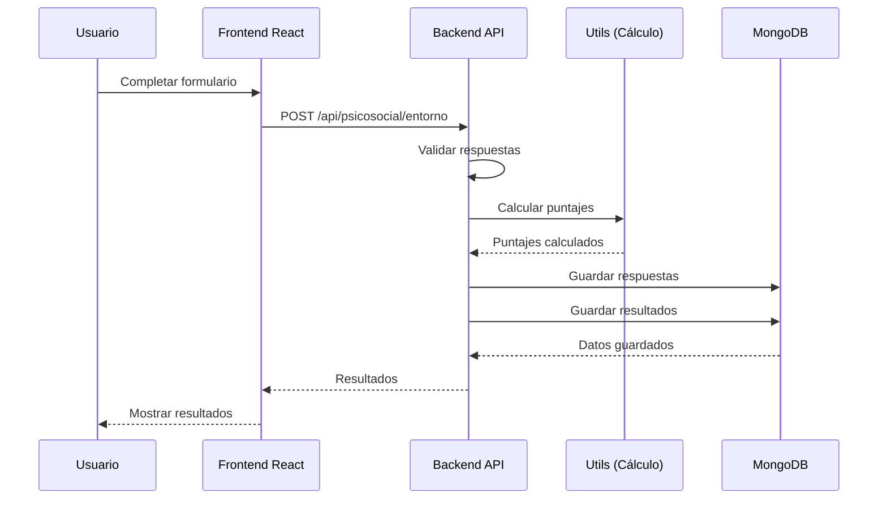

## Flujo de Datos - Visualización de Resultados

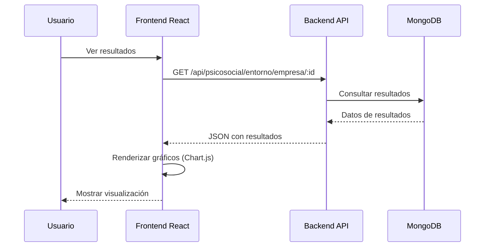

## Estructura de Componentes Frontend

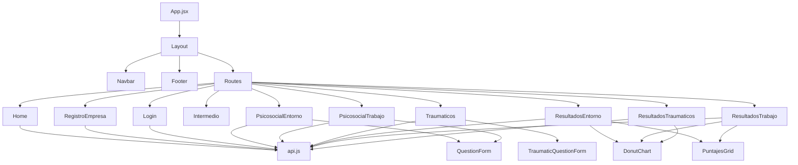

## Estructura Backend - Capas

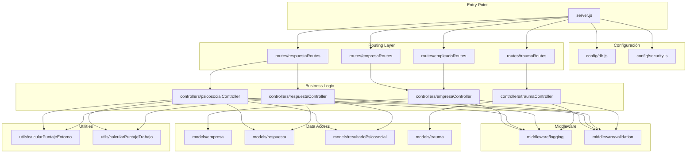

## Modelo de Datos MongoDB

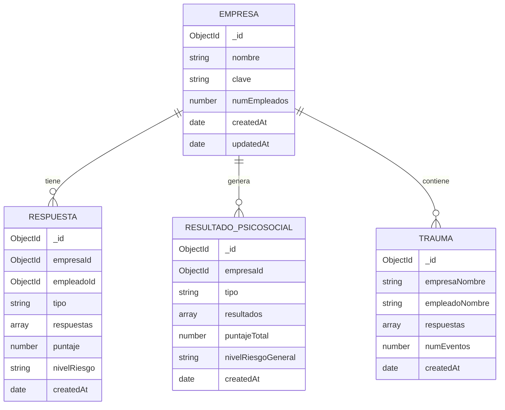

## Flujo de Autenticación

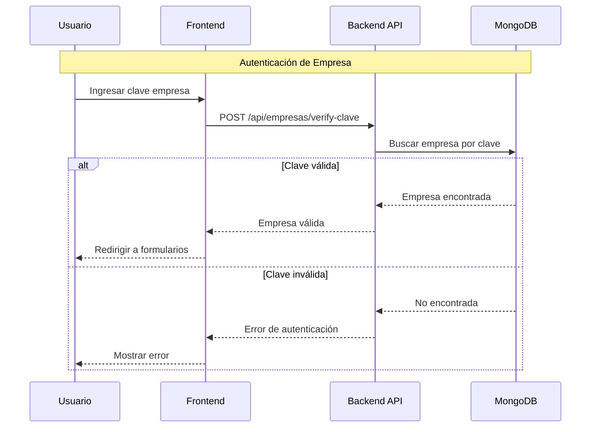

## Flujo de Cálculo de Puntajes

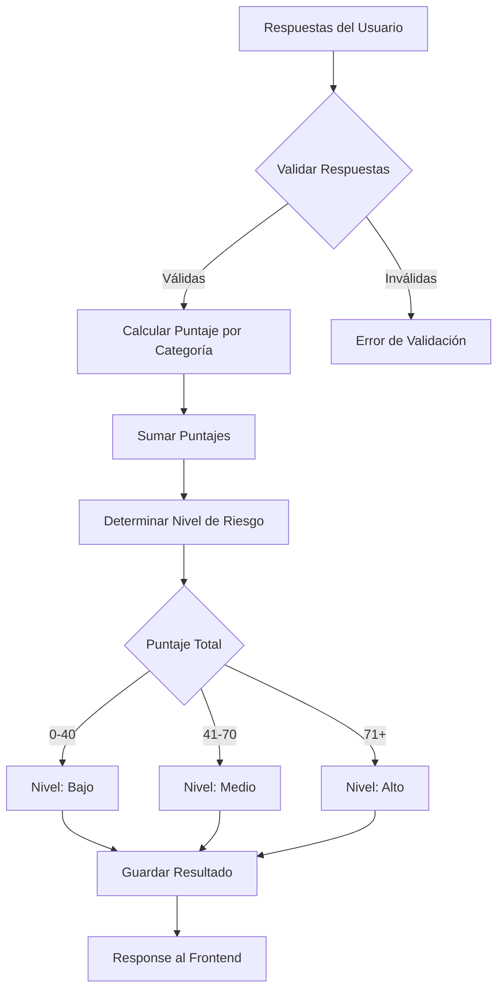

## Arquitectura de Seguridad

```mermaid
graph LR
    A[Request HTTP] --> B[Helmet]
    B --> C[CORS]
    C --> D[Rate Limiting]
    D --> E[Request Size Limiter]
    E --> F[Content Type Validator]
    F --> G[Request Logger]
    G --> H[Suspicious Activity Detector]
    H --> I[Validation Middleware]
    I --> J[Routes]
    
    style B fill:#ff6b6b
    style C fill:#ff6b6b
    style D fill:#ff6b6b
    style E fill:#ff6b6b
    style F fill:#ff6b6b
    style G fill:#ff6b6b
    style H fill:#ff6b6b
    style I fill:#ff6b6b
```

## Stack Tecnológico

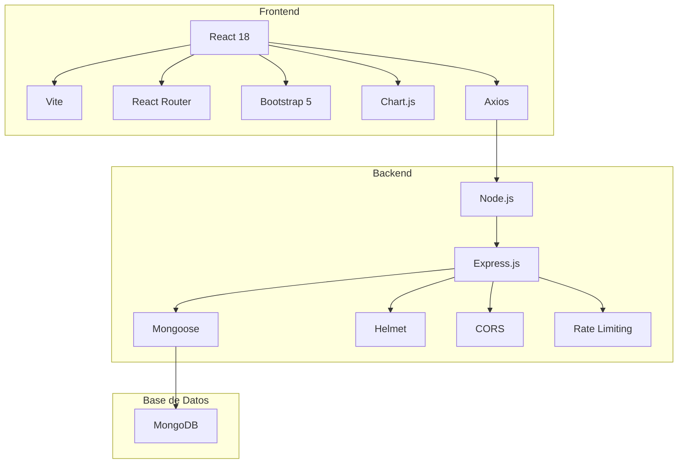

